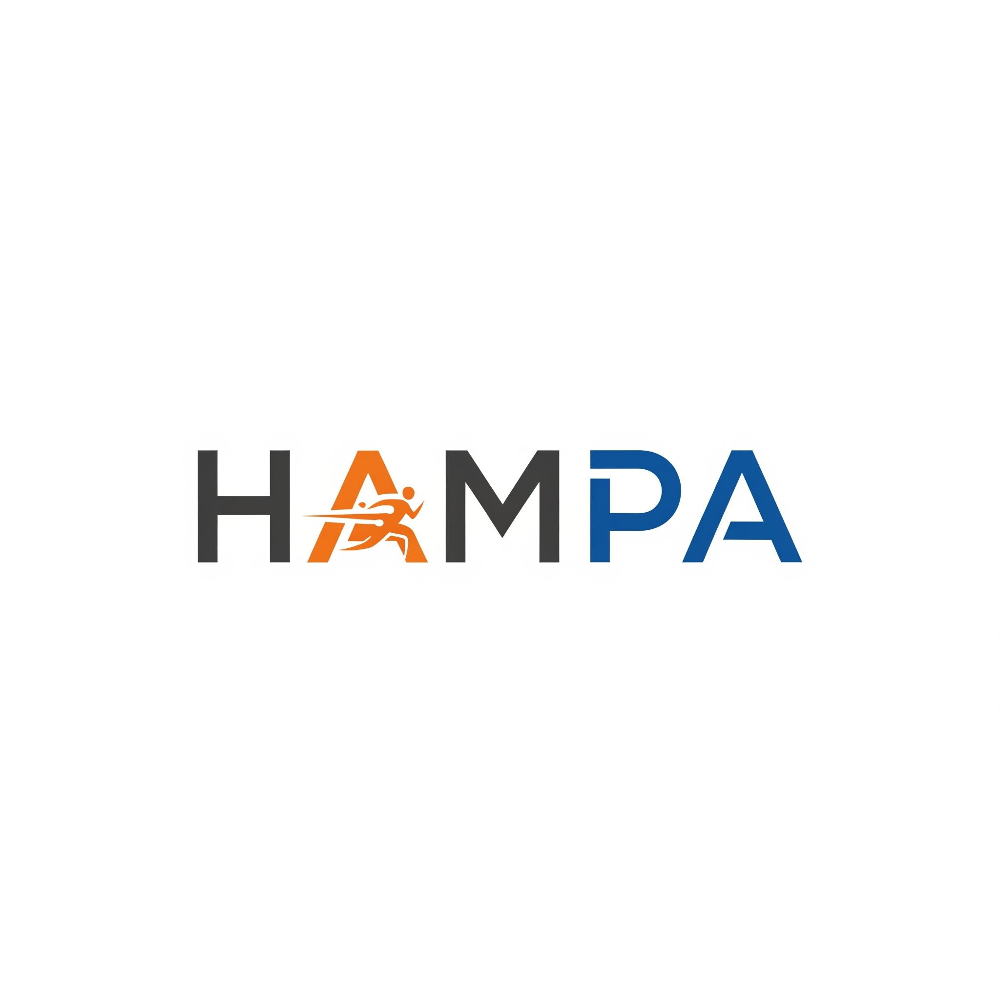

# مستندات برنامه هم‌پا 👋

## توضیحات پروژه

هم‌پا یک برنامه وب مدرن است که با React و TypeScript ساخته شده است و برای ارائه یک تجربه کاربری بی‌نقص برای مدیریت کارت‌های دونده، کاوش در اجراهای مشترک، مدیریت احراز هویت و موارد دیگر طراحی شده است. این مستندات یک نمای کلی جامع از پروژه، ویژگی‌های آن و نحوه مشارکت را ارائه می‌دهد.

## ✨ ویژگی‌ها

هم‌پا مجموعه‌ای از ویژگی‌ها را برای بهبود تعامل و عملکرد کاربر ارائه می‌دهد:

### احراز هویت کاربر 🔐
- **ورود شماره تلفن:** شماره تلفن خود را برای ثبت نام یا ورود به سیستم به صورت امن وارد کنید.
- **تأیید OTP:** هویت خود را با استفاده از رمز عبور یکبار مصرف ارسال شده به تلفن خود تأیید کنید.
- **ورود/خروج:** جریان احراز هویت استاندارد برای دسترسی به ویژگی‌های محافظت شده.

### مدیریت کارت 💳
- **ایجاد کارت:** به راحتی کارت‌های دونده جدید با جزئیات مربوطه ایجاد کنید.
- **کارت‌های من:** مجموعه شخصی کارت‌های دونده خود را مشاهده و مدیریت کنید.
- **جزئیات کارت:** اطلاعات دقیق در مورد یک کارت دونده خاص را مشاهده کنید.
- **لیست کارت‌ها:** لیستی از کارت‌های دونده موجود را مرور کنید.
- **اسلایدر کارت‌ها:** نمایش بصری جذاب کارت‌های دونده در قالب اسلایدر.

### اجراهای مشترک 🤝
- **کاوش اجراها:** اجراها یا فعالیت‌های مشترک موجود را کشف کنید.
- **لیست اجراهای مشترک:** لیستی از اجراهای مشترک را مشاهده کنید.
- **ادغام کارت دونده:** کارت‌های دونده خود را به اجراهای مشترک متصل کنید.

### پروفایل کاربر 👤
- **مدیریت پروفایل:** اطلاعات پروفایل کاربری خود را مشاهده و به روز کنید.

### اعلان‌ها 🔔
- **پنل اعلان‌ها:** اعلان‌های برنامه را دریافت و مدیریت کنید.

### اشتراک‌ها 💎
- **مدال اشتراک:** اشتراک‌های کاربر و اقدامات مربوطه را مدیریت کنید.

### کامپوننت‌های مشترک 🧩
- **لودر:** نشانگر بصری برای حالت‌های بارگذاری.
- **چیدمان:** چیدمان برنامه سازگار با هدر و ناوبری پایین.
- **هدر:** کامپوننت هدر برنامه.
- **ناوبری پایین:** ناوبری آسان بین بخش‌های اصلی برنامه.

## 🚀 شروع به کار

دستورالعمل‌هایی در مورد نحوه راه‌اندازی و اجرای پروژه به صورت محلی.

(مراحل نصب و راه‌اندازی خاص را در اینجا اضافه کنید، به عنوان مثال: کلون کردن مخزن، نصب وابستگی‌ها، اجرای سرور توسعه)

## 🛠️ راهنمای مشارکت

ما از مشارکت در هم‌پا استقبال می‌کنیم! لطفاً [CODE_OF_CONDUCT.md](CODE_OF_CONDUCT.md) ما را بخوانید تا رفتار مورد انتظار در جامعه ما را درک کنید.

برای مشارکت:
1. مخزن را فورک کنید.
2. یک شاخه جدید برای ویژگی یا رفع اشکال خود ایجاد کنید.
3. تغییرات خود را اعمال کنید و اطمینان حاصل کنید که از استانداردهای کدنویسی پروژه پیروی می‌کنند.
4. پیام‌های کامیت واضح و مختصر بنویسید.
5. یک درخواست پول با توضیحات دقیق تغییرات خود ارسال کنید.

## 📄 مجوز

این پروژه تحت [مجوز AGPL 3.0](LICENSE) مجوز دارد.

## 🌐 زبان‌های دیگر

- [English](README.md)
